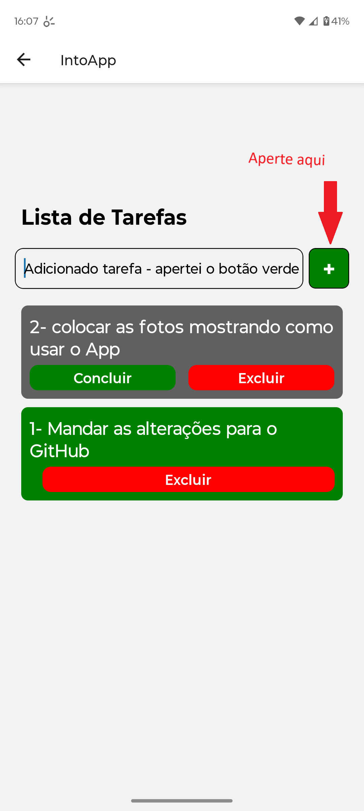

# React Native - Lista de Tarefas

Lista de tarefas feita em React Native que salva as tarefas na memória do próprio celular utilizando o recurso AsyncStorage( npm install @react-native-async-storage/async-storage). 
 

Etapas: 
    1- Tela de autenticação(Login) fake - OK   CREDENCIAIS= "admin & 1234" 
    2- Salvar as tarefas no próprio celular - OK 
    3- Botões de "Concluir" e "Remover" tarefa - OK 
    4- Menu(Drawer) que permite configurar o Banco de Dados escolhido para Salvar as TAREFAS, salva a URL do BD na memória do CELULAR- OK 
    5- Salvar/Remover/Atualizar as tarefas no "Bando de Dados" - OK 
    6- Fazer um Back-end que busque o usuário no Banco de Dados comparando as Senhas  -  Pendente 

*** Para trabalhar com ROTAS manualmente, foi preciso: 
    - Modificar o arquivo "package.json" no campo de "main": "expo-router/entry"  PARA "main": "index.js" 
    - Dentro do arquivo "index.js", importar "registerRootComponent" e o COMPONENTE que contém o <NavigationContainer>(contém as configurações das ROTAS).  
    - E registrar este COMPONENTE com:   ex.:  registerRootComponent(COMPONENTE) 
 
Próximo passo: 5-Salvar/remover/atualizar as tarefas no BD; 

 
 
 
 
## COMO USAR O APP - Demonstração com IMAGENS: 
 
    1- Fazer o LOGIN:  usuário: "admin",   senha: 1234  
        
    2- Escreva a TAREFA que deseja fazer e Aperte o botão de Adicionar, botão que tem + ( "+" )   
    
    3- Você pode CONCLUIR uma Tarefa e assim o Fundo dela ficará todo Verde. 
    4- E por fim, pode EXCLUIR a Tarefa clicando no botão VERMELHO 
 
 
 
 
 
Query's no Banco de Dados: 
&emsp;&emsp; 1- CREATE DATABASE app_todo_list;    // Cria o Banco de Dados
&emsp;&emsp;2- CREATE TABLE IF NOT EXISTS tarefas ( // Cria uma TABELA se não existir  
	&emsp;&emsp;&emsp;id SERIAL PRIMARY KEY, 
	&emsp;&emsp;&emsp;tarefa VARCHAR(255) NOT NULL, 
	&emsp;&emsp;&emsp;status VARCHAR(10) NOT NULL 
&emsp;&emsp;); 
&emsp;&emsp;3- INSET INTO tarefa (id, tarefa, status) VALUES (${1}, ${2}, ${3}); //Usado para inserir cada TAREFA individualmente. 
&emsp;&emsp;4- DELETE FROM tarefas WHERE id=${1};   // Deleta uma tarefa usando como parâmetro o ID 
&emsp;&emsp;5- UPDATE tarefas SET status=${1} WHERE id=${2};  // Atualiza o STATUS de uma TAREFA, recebe 2 parâmetros: [novoStatus, id]